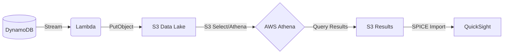

# AWS Serverless BI Pipeline

A complete end-to-end Business Intelligence pipeline using AWS serverless services. This project demonstrates how to ingest data into DynamoDB, stream it to an S3 Data Lake via Lambda, query it with Athena, and visualize it in QuickSight.

## 🏗️ Architecture Flow




1.  **DynamoDB**: Primary data store for operational order data.
2.  **DynamoDB Streams**: Captures real-time changes (Insert/Modify) in the table.
3.  **AWS Lambda**: Triggered by the stream, flattens the data, and stores it in S3 as JSON/Parquet.
4.  **Amazon S3**: Acts as the Data Lake, storing raw and processed data.
5.  **AWS Glue & Athena**: Glue Catalogs the S3 data; Athena provides a serverless SQL query interface.
6.  **Amazon QuickSight**: Connects to Athena to create interactive dashboards and visualizations.

> [!NOTE]
> **Athena & S3 Storage Limit**: When QuickSight uses SPICE (Super-fast, Parallel, In-memory Calculation Engine), it imports data from Athena. Athena query results are stored in an S3 bucket. While Athena can handle petabytes of data, QuickSight's SPICE mode has specific import limits (like the 6MB reference for small tests) depending on your tier, but generally stores the query results in an S3 results bucket for retrieval.

## 📂 Project Structure

```text
aws-serverless-bi-pipeline/
├── README.md                 # Project guide
├── architecture-flow.jpg     # Architecture diagram
├── infrastructure/
│   ├── template.yaml         # AWS SAM/CloudFormation template
│   └── iam_policies.json     # Least-privilege IAM roles
├── data/
│   └── sample_dataset.json   # Mock e-commerce data
├── scripts/
│   └── load_dynamodb.py      # Boto3 script to populate DynamoDB
└── sql/
    ├── create_glue_catalog.sql # Athena DDL for table creation
    └── quicksight_views.sql    # Business SQL views for visualization
```
Serverless BI Architecture: Delivering Real-Time Insights from NoSQL Data This project demonstrates a modernized approach to Business Intelligence. Instead of building complex, brittle, and expensive **ETL** (Extract, Transform, Load) pipelines to move data from a NoSQL database into a data warehouse, this architecture uses **AWS** Federated Query to analyze operational data in place.

## Data Source: Amazon DynamoDB (The Operational Foundation)

The **BIE** Angle: DynamoDB houses the live, transactional application data. By querying this directly, we eliminate data latency. Business stakeholders get access to near real-time metrics instead of waiting for a 24-hour batch **ETL** job to complete.

## Data Cataloging: AWS Glue (Schema-on-Read Definition)

The **BIE** Angle: BIEs live in **SQL**, but DynamoDB is a key-value/document store. **AWS** Glue bridges this gap. It acts as the metadata repository, applying a structured, relational schema over the NoSQL data so that it can be queried exactly like a traditional **SQL** table.

## Federated Query Bridge: AWS Lambda Connector (Invent and Simplify)

The **BIE** Angle: This is where we replace traditional **ETL**. Instead of moving data, Athena uses this Lambda function to push **SQL** queries down to the DynamoDB source. Lambda translates the **SQL** into native DynamoDB **API** calls, retrieves the specific data needed, and formats it for analysis, drastically reducing infrastructure overhead.

## Bypassing Limits: Amazon S3 Spill Bucket (Ensuring Reliability at Scale)

The **BIE** Angle: BI queries often involve heavy aggregations (e.g., Year-to-Date sales) that return massive datasets. **AWS** Lambda has a hard 6 MB payload limit. To ensure business dashboards never break during large queries, this architecture automatically *spills* data exceeding 6 MB into an S3 bucket. Athena seamlessly stitches the Lambda response and S3 data together, guaranteeing reliable query execution for end-users regardless of data volume.

## Query Execution: Amazon Athena (The Analytical Engine)

The **BIE** Angle: Athena (built on Presto/Trino) serves as the core analytical engine. This is where the **BIE** writes optimized **ANSI** **SQL** to create views, perform complex joins, and aggregate the raw DynamoDB data into meaningful business metrics without provisioning any servers.

## Visualization & BI: Amazon QuickSight (Driving Business Decisions)

The **BIE** Angle: This is the customer-facing layer. QuickSight connects directly to Athena to ingest the processed data (often utilizing **SPICE** for faster performance). It translates the **SQL** outputs into interactive, self-service dashboards, enabling business leaders to track KPIs and make data-driven decisions instantly.
## 🚀 Getting Started

### 1. Deploy Infrastructure
Ensure you have the [AWS SAM CLI](https://docs.aws.amazon.com/serverless-application-model/latest/developerguide/install-sam-cli.html) installed.
```powershell
cd infrastructure
sam build
sam deploy --guided
```

### 2. Load Sample Data
Run the Python script to populate your DynamoDB table with mock orders.
```powershell
pip install boto3
python scripts/load_dynamodb.py
```

### 3. Set Up Athena
Go to the **Athena Query Editor** in the AWS Console and run the DDL script found in `sql/create_glue_catalog.sql`. This will create the `orders` table pointing to your S3 bucket.

### 4. Create Business Views
Run the queries in `sql/quicksight_views.sql` to create optimized views for your dashboard (e.g., Revenue by Category, Monthly Trends).

### 5. Visualize in QuickSight
1. Open **Amazon QuickSight**.
2. Create a **New Dataset** using **Athena**.
3. Select the `bi_pipeline_db` and your desired view.
4. Start building your "Aha!" moments!

## 🔒 Security & IAM
The project follows the principle of least privilege. Check `infrastructure/iam_policies.json` for a detailed breakdown of the roles used by Lambda, Athena, and QuickSight.
