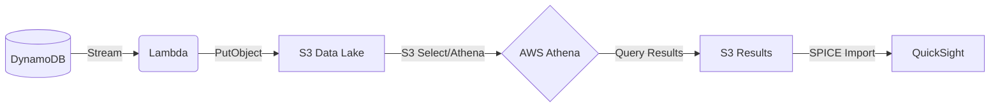

# AWS Serverless BI Pipeline

A complete end-to-end Business Intelligence pipeline using AWS serverless services. This project demonstrates how to ingest data into DynamoDB, stream it to an S3 Data Lake via Lambda, query it with Athena, and visualize it in QuickSight.

## 🏗️ Architecture Flow




1.  **DynamoDB**: Primary data store for operational order data.
2.  **DynamoDB Streams**: Captures real-time changes (Insert/Modify) in the table.
3.  **AWS Lambda**: Triggered by the stream, flattens the data, and stores it in S3 as JSON/Parquet.
4.  **Amazon S3**: Acts as the Data Lake, storing raw and processed data.
5.  **AWS Glue & Athena**: Glue Catalogs the S3 data; Athena provides a serverless SQL query interface.
6.  **Amazon QuickSight**: Connects to Athena to create interactive dashboards and visualizations.

> [!NOTE]
> **Athena & S3 Storage Limit**: When QuickSight uses SPICE (Super-fast, Parallel, In-memory Calculation Engine), it imports data from Athena. Athena query results are stored in an S3 bucket. While Athena can handle petabytes of data, QuickSight's SPICE mode has specific import limits (like the 6MB reference for small tests) depending on your tier, but generally stores the query results in an S3 results bucket for retrieval.

## 📂 Project Structure

```text
aws-serverless-bi-pipeline/
├── README.md                 # Project guide
├── architecture-flow.jpg     # Architecture diagram
├── infrastructure/
│   ├── template.yaml         # AWS SAM/CloudFormation template
│   └── iam_policies.json     # Least-privilege IAM roles
├── data/
│   └── sample_dataset.json   # Mock e-commerce data
├── scripts/
│   └── load_dynamodb.py      # Boto3 script to populate DynamoDB
└── sql/
    ├── create_glue_catalog.sql # Athena DDL for table creation
    └── quicksight_views.sql    # Business SQL views for visualization
```

## 🚀 Getting Started

### 1. Deploy Infrastructure
Ensure you have the [AWS SAM CLI](https://docs.aws.amazon.com/serverless-application-model/latest/developerguide/install-sam-cli.html) installed.
```powershell
cd infrastructure
sam build
sam deploy --guided
```

### 2. Load Sample Data
Run the Python script to populate your DynamoDB table with mock orders.
```powershell
pip install boto3
python scripts/load_dynamodb.py
```

### 3. Set Up Athena
Go to the **Athena Query Editor** in the AWS Console and run the DDL script found in `sql/create_glue_catalog.sql`. This will create the `orders` table pointing to your S3 bucket.

### 4. Create Business Views
Run the queries in `sql/quicksight_views.sql` to create optimized views for your dashboard (e.g., Revenue by Category, Monthly Trends).

### 5. Visualize in QuickSight
1. Open **Amazon QuickSight**.
2. Create a **New Dataset** using **Athena**.
3. Select the `bi_pipeline_db` and your desired view.
4. Start building your "Aha!" moments!

## 🔒 Security & IAM
The project follows the principle of least privilege. Check `infrastructure/iam_policies.json` for a detailed breakdown of the roles used by Lambda, Athena, and QuickSight.
